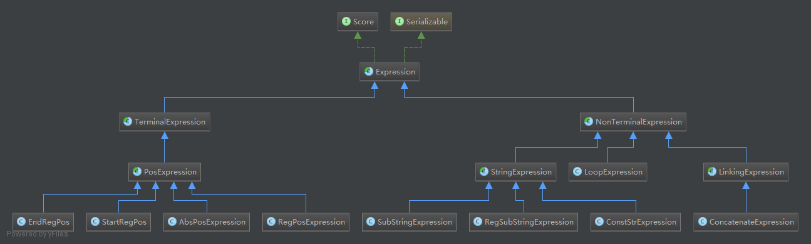
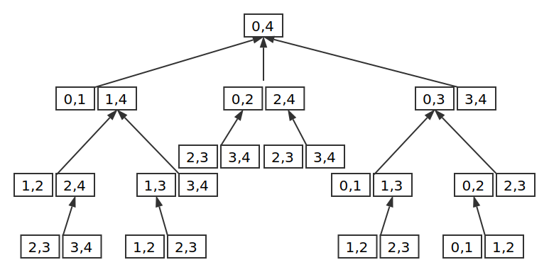
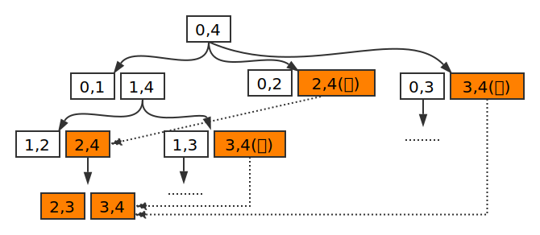
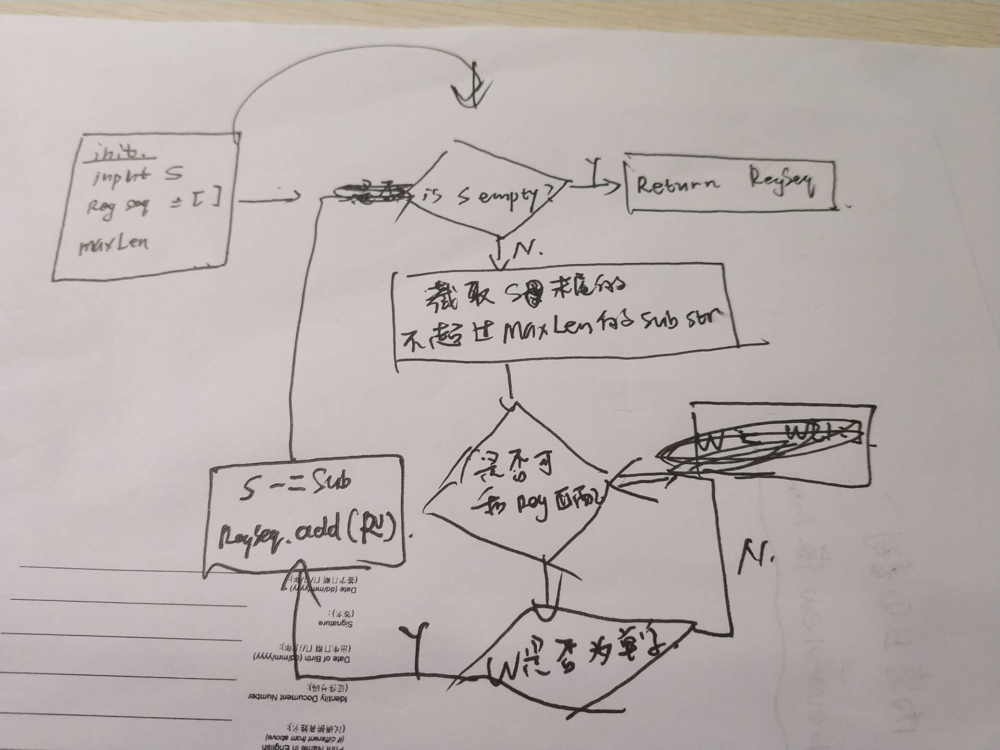

## Title

In this work package, we introduce a new approach with its supporting platform which...


For non-programmers: 

### Installation

- TODO

### How to use

The same as we demonstrated in "XXXX video url" that :

* Upload text document by clicking the "Start" button
* Select what you need using your mouse, our program synthesis system will program for you to do what you want to do.
* (If you need, )Right-click on the column to perform further data manipulation via providing a few examples.
* Click the "Save as csv" button to download all the extracted and manipulated data for future use.


For programmers: 

### Installation

- Download or clone this repository, and open it in your IDE.
- Download Tomcat Server (or other server you prefer) and deploy it.
- Configure the Run/Debug configuration of the server among your IDE like XXXXX and run it.
- A web page deployed on the local Tomcat server will pop up.

### How to use

1. For daily use

   Just use it in the same way as non-programmers.

2. For secondary development

   Please refer to the **Implementation Details** section and **How to do extension** section.

   

### implementation Details

1. The implementation of our DSL

   We implement the DSL in Interpreter pattern (one of the classical design patterns).The main code locate in "interpreter" package. 

   

   Figure X shows the hierarchy of our DSL. All the DSLs inherit from the topmost abstract class Expression. Expressions are divided into  NonTerminalExpression and TerminalExpression,
   where NonTerminalExpression can futher absorbe other expressions while TerminalExpression cannot.
   All the built expressions, no matter how complex or simply they are, have the ability to interpret alone and can be esaily transformed into real programs written in general programming language such as Java or Python.

   Besides, there is an interface named "Score" that each expression should implement, which is used in combination search & ranking algorithm.

   

2. The implementation of combination search & ranking algorithm

   TODO: 引用论文中解释DAG的章节, 然后加上beam search

   beam search & 记忆化搜索

   

   

3. The implementation of format clustering algorithm

   look at the following two strings:

   > Bus Station,40.7572213,-73.99154663, Jun 27 13:14:26
   > Coffee Shop,40.72795461,-73.99326138,Oct 08 20:11:11

   It is obvious that although they have different value, the format among them is exactly same. If our system can recognize the pattern of the content contained in the string, it can correctly process each kind of format separately. In this work we novelly adopted Reverse Maximum Matching (RMM) algorithm , which is commonly used for word segmentation in NLP, to identify the format of the given strings. 

   

   Figure X shows the steps of RMM algorithm. Given 


### How to do extension

1. Main APIs

   There four main steps when during each program generation process, feel free to use or overwrite these four main APIs:

   - Get example pairs in ExamplePair (defined in model package) format. The getExamplePairs() function can be defined according to different scenarios.

     ```java
     List<ExamplePair> examplePairs = getExamplePairs();
     ```

   - New an instance of StringProcessor (defined in the root path) and figure out how to generate each piece of the target output string in the given example pairs.

     ```java
     StringProcessor stringProcessor = new StringProcessor();
     List<ResultMap> resultMaps = stringProcessor.generateExpressionsByExamples(examplePairs);
     ```

   - Search a appropriate combination using beam search.

     ```java
     int beamWidth=10;
     List<ExpressionGroup> expressionGroups = stringProcessor.combinateSubPrograms(resultMaps, beamWidth);
     ```

   - Identify format clusters

     ```java
     List<ExampleCluster> clusters = stringProcessor.formatClustering(expressionGroups, examplePairs);
     ```

     

2. How to define your own DSL

3. How to extend the string processing core to other application scenarios


